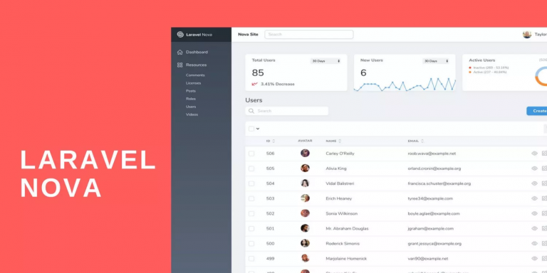

# Laravel nova v4 use local



### Unzip nova package in ./api/package/private/nova
in composer.json use your version nova
example
```bash
    "require": {
        .....
        "laravel/nova": "4.26.5",
        .....
    }
```

### Start docker
Using [makefile](https://opensource.com/article/18/8/what-how-makefile)
```bash
make init
```

### Install nova
```bash
docker compose run --rm api-php-cli php artisan nova:install
```
run migrate
```bash
docker compose run --rm api-php-cli php artisan migrate
```
Create user
```bash
docker compose run --rm api-php-cli php artisan nova:user
```

Nova url 
>http://localhost:8081/nova/

### Modify nova 
cd api/package/private/nova
Modify code in 'resources' folder

Install packages 
```bash
npm install
```
Run build
```bash
npm run prod
```

finally copy assets files

```bash
api/package/private/nova/public > api/public/vendor/nova
```
